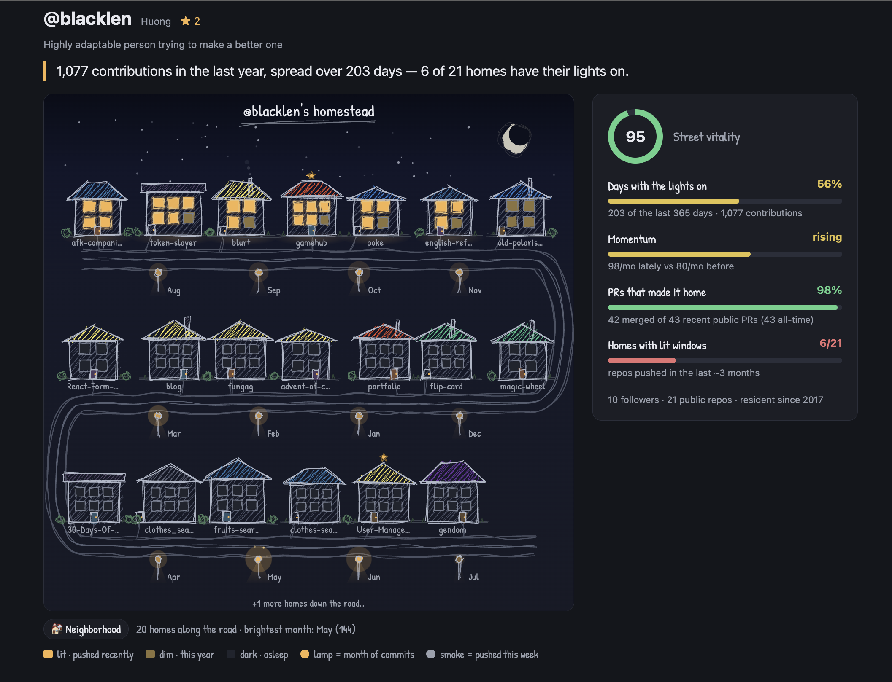

# GitHub Homestead 🏡

Type a GitHub username and see their year as a hand-doodled village — one home
per repo, street lamps for each month of commits, and windows that light up
when a repo has been pushed recently.

**Live demo:** https://github-homestead.netlify.app



*My own homestead*

## How to read the village

- 🏠 **Homes** are repos. Lit windows = pushed recently, dim = touched this
  year, dark = asleep. Roof colors match the repo's main language, stars sit
  on starred repos, and smoke means a push this week.
- 💡 **Street lamps** are months. The brighter the lamp, the busier the month.
- 📊 **Street vitality** sums it up: active days, momentum, and PR merge rate.

## Run it locally

No build, no dependencies — just serve the folder:

```bash
python3 -m http.server 8000
# or: npx serve
```

Everything runs in the browser using public GitHub data (no token needed —
and please don't add one; client-side code is public).

Not affiliated with GitHub.
